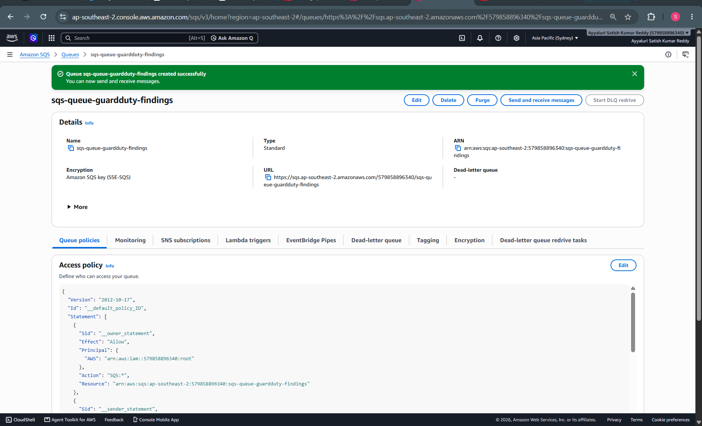
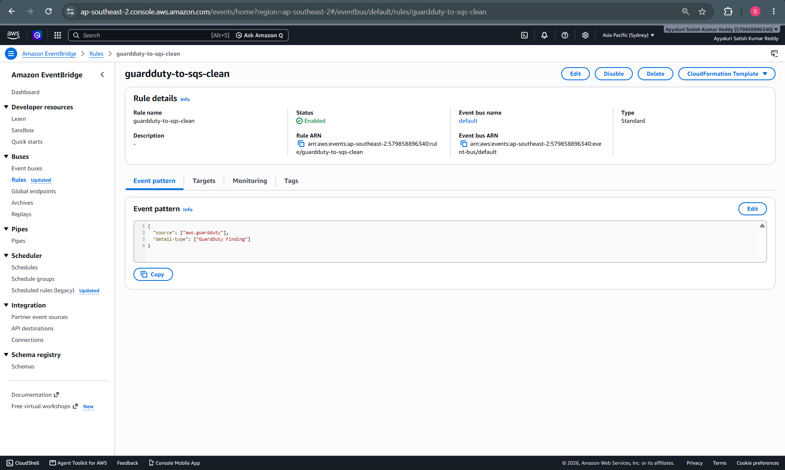
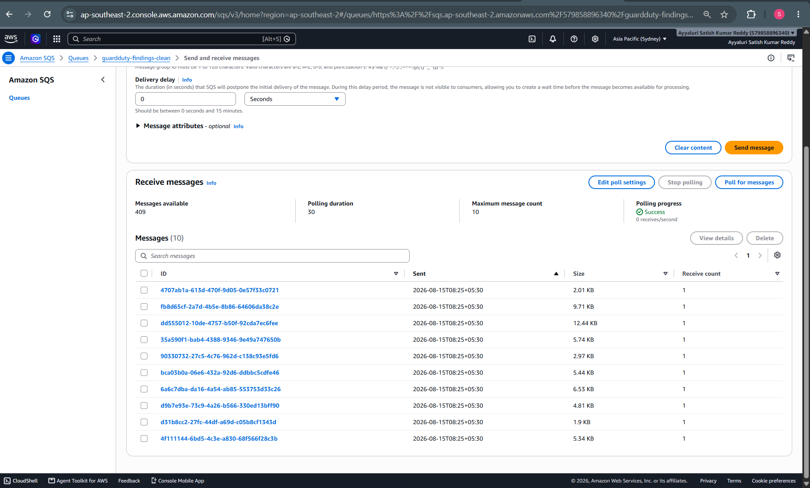
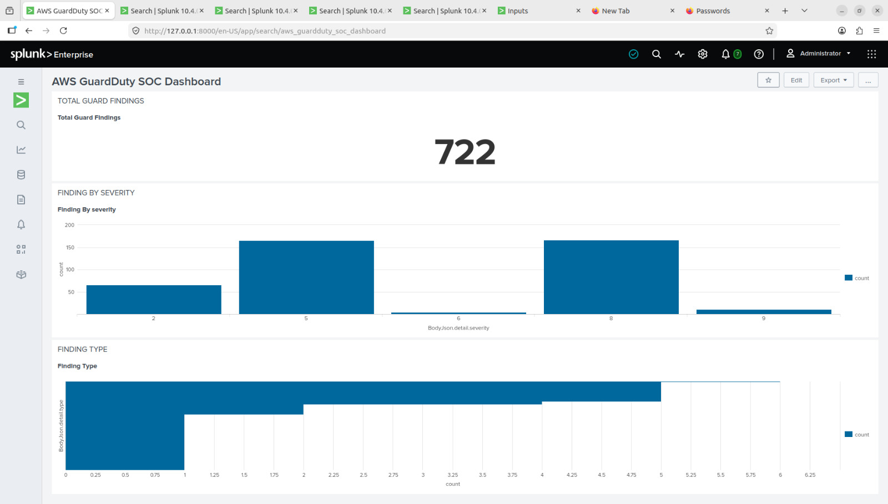

# AWS GuardDuty Security Monitoring with Splunk

## Overview

This project demonstrates a cloud security monitoring pipeline that sends Amazon GuardDuty security findings to Splunk Enterprise for centralized monitoring and visualization.

## Architecture

Amazon GuardDuty  
↓  
Amazon EventBridge  
↓  
Amazon SQS  
↓  
Splunk Enterprise  
↓  
SOC Dashboard

## Technologies Used

- Amazon GuardDuty
- Amazon EventBridge
- Amazon SQS
- Splunk Enterprise
- Splunk Add-on for AWS

## Project Implementation

### 1. Amazon GuardDuty

Enabled Amazon GuardDuty and monitored security findings generated in the AWS environment.



### 2. Amazon EventBridge

Created an EventBridge rule to detect GuardDuty Finding events.

Event pattern:

```json
{
  "source": ["aws.guardduty"],
  "detail-type": ["GuardDuty Finding"]
}
```



### 3. Amazon SQS

Created an SQS queue named `guardduty-findings-clean` to receive GuardDuty findings from EventBridge.

The queue was verified to receive GuardDuty Finding JSON messages.



### 4. Splunk Enterprise

Configured the Splunk Add-on for AWS with an SQS input to ingest GuardDuty findings.

The findings were successfully received and searchable in Splunk.

### 5. SOC Dashboard

Created a Splunk SOC dashboard to monitor:

- Total GuardDuty findings
- Findings by severity
- Finding types



## Validation

The complete data flow was successfully validated:

**GuardDuty → EventBridge → SQS → Splunk**

A GuardDuty Finding event was received by SQS and successfully ingested into Splunk.

## Security Finding Example

A GuardDuty finding used during the project was:

- Finding Type: `PrivilegeEscalation:Runtime/DockerSocketAccessed`
- Severity: 5
- Region: `ap-southeast-2`

Sample findings were used to safely validate the event pipeline.

## Skills Demonstrated

- AWS cloud security monitoring
- Amazon GuardDuty
- Amazon EventBridge
- Amazon SQS
- Splunk Enterprise
- Splunk Add-on for AWS
- SIEM monitoring
- Security event ingestion
- JSON event analysis
- SIEM dashboards
- Cloud security troubleshooting

## Key Learning

This project demonstrates how cloud security findings can be routed through an event-driven AWS architecture and centralized in a SIEM for monitoring and analysis.

## Project Result

Successfully built and validated an AWS GuardDuty security monitoring pipeline integrated with Splunk Enterprise.

Final architecture:

**GuardDuty → EventBridge → SQS → Splunk**
